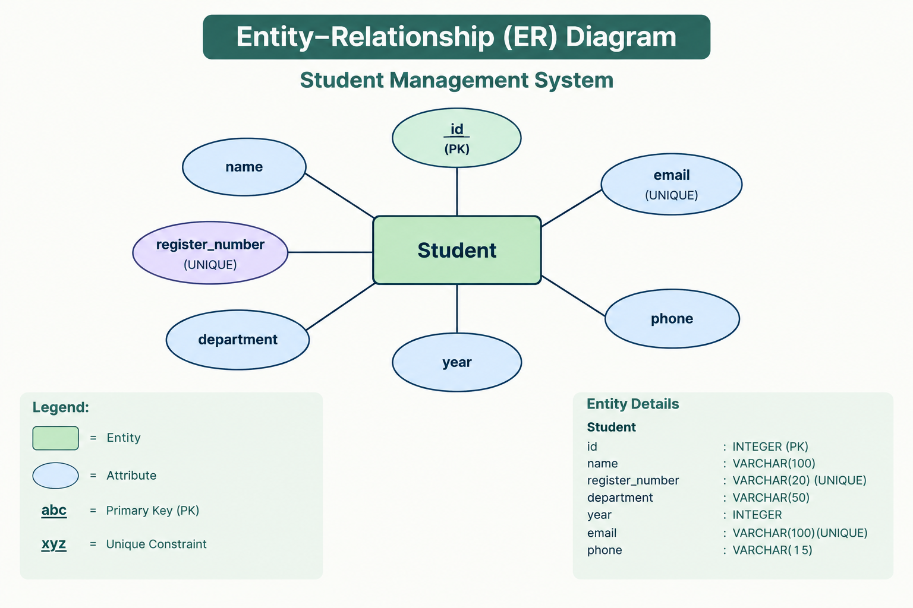
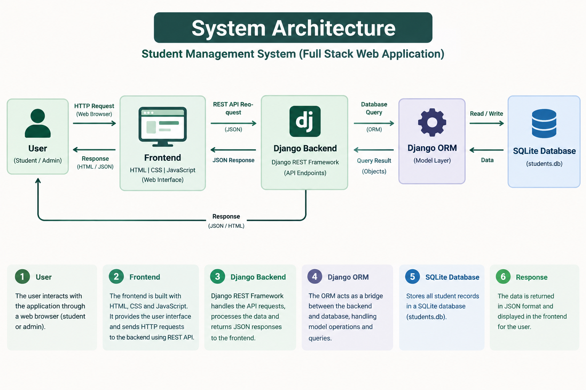
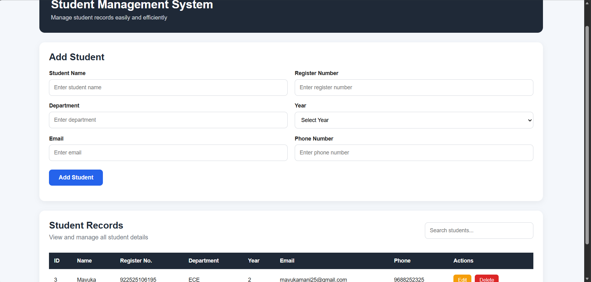
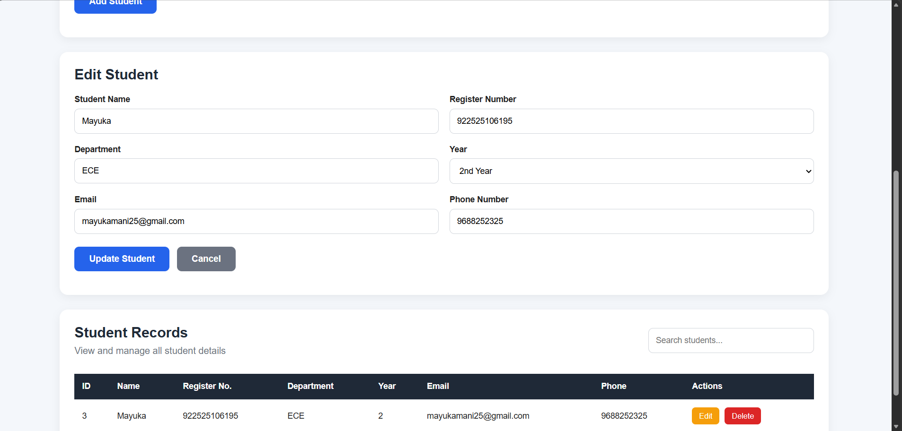
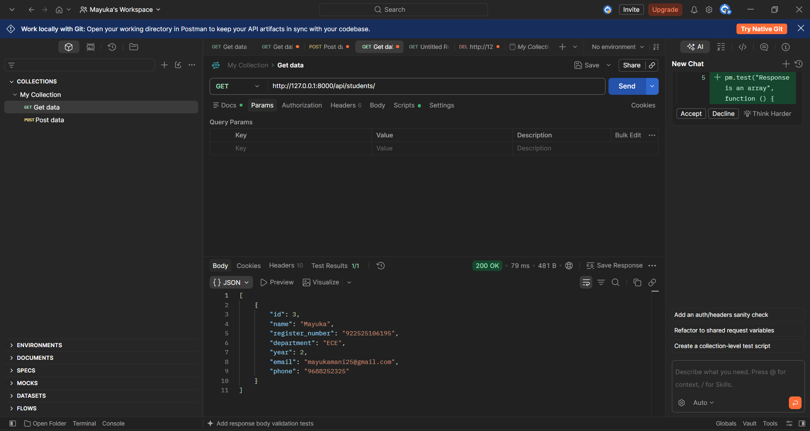
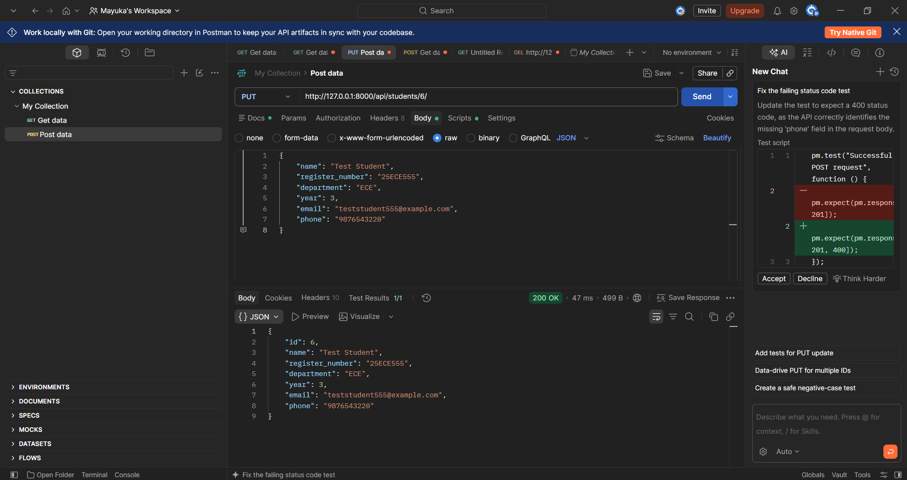
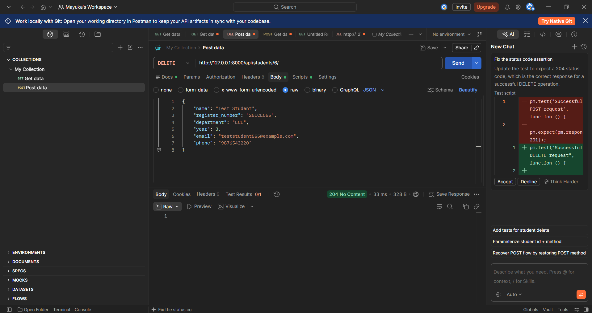

# Student Management System

## 1. Project Overview

The Student Management System is a full-stack web application developed to manage student records efficiently. It provides a user-friendly frontend, a RESTful backend API, and a database for storing student information.

The system supports the complete CRUD operations:

- Create student records
- Read and view student records
- Update existing student records
- Delete student records

The application also includes client-side and server-side validation, search functionality, error handling, API testing, and database integration.

## 2. Problem Statement

Managing student information manually can be time-consuming and may lead to data entry errors, duplicate records, and difficulty in updating or retrieving information.

The Student Management System provides a centralized web-based solution for storing, viewing, updating, searching, and deleting student records through a simple interface.

## 3. Objectives

- To develop a full-stack student management web application.
- To implement complete CRUD functionality.
- To provide RESTful APIs for student data management.
- To store student information in a database.
- To implement client-side and server-side validation.
- To prevent duplicate register numbers and email addresses.
- To provide search functionality for student records.
- To test the application and its APIs using Postman.
- To provide proper documentation and error handling.

## 4. Scope

The system manages student details such as:

- Student ID
- Name
- Register Number
- Department
- Year
- Email
- Phone Number

The application can be extended in the future with authentication, attendance management, marks management, and other student-related features.

## 5. Technology Stack

### Frontend
- HTML5
- CSS3
- JavaScript

### Backend
- Python
- Django
- Django REST Framework

### Database
- SQLite

### Development and Testing Tools
- Visual Studio Code
- Postman
- Git
- GitHub
- Live Server

## 6. System Requirements

### Hardware Requirements
- Computer/Laptop
- Minimum 4 GB RAM
- Internet connection

### Software Requirements
- Python 3.x
- Django
- Django REST Framework
- Visual Studio Code
- Web Browser
- Postman
- Git

## 7. System Architecture

The Student Management System follows a three-layer full-stack architecture:

1. **Frontend Layer**
   - Developed using HTML, CSS, and JavaScript.
   - Provides the user interface for entering, viewing, searching, editing, and deleting student records.
   - Sends HTTP requests to the backend REST API.

2. **Backend Layer**
   - Developed using Python, Django, and Django REST Framework.
   - Receives requests from the frontend.
   - Performs validation and CRUD operations.
   - Provides RESTful API endpoints for student management.

3. **Database Layer**
   - Uses SQLite database.
   - Stores student records permanently.
   - Django ORM is used to communicate between the backend and database.

   ### Entity-Relationship Diagram



### System Workflow

```text
User
  ↓
Frontend
(HTML + CSS + JavaScript)
  ↓
REST API
(Django REST Framework)
  ↓
Django ORM
  ↓
SQLite Database
  ↓
Response
  ↑
Frontend
  ↑
User


Data Flow
The user enters student details through the frontend.
JavaScript performs client-side validation.
The frontend sends the request to the Django REST API.
Django REST Framework validates the received data.
Valid data is processed using Django ORM.
The student information is stored or retrieved from SQLite.
The backend sends an HTTP response to the frontend.
The frontend displays the updated result to the user.


### System Architecture Diagram



## 8. Database Design

The application uses an SQLite database to store student information.

### Student Table

| Field | Data Type | Constraints | Description |
|---|---|---|---|
| id | Integer | Primary Key | Unique student ID |
| name | String | Required | Student name |
| register_number | String | Required, Unique | Student register number |
| department | String | Required | Student department |
| year | Integer | 1–4 | Current academic year |
| email | String | Required, Unique, Valid Email | Student email address |
| phone | String | Required, 10 digits | Student phone number |

### Database Relationships

The current application contains a single `Student` table, so there are no foreign-key relationships between multiple tables.

Django ORM is used to create, retrieve, update, and delete records in the SQLite database.

## 9. REST API Documentation

The backend provides RESTful API endpoints for managing student records.

### Base URL

```text
http://127.0.0.1:8000/api/

API Endpoints

| Method | Endpoint              | Purpose                     |
| ------ | --------------------- | --------------------------- |
| GET    | `/api/students/`      | Retrieve all students       |
| POST   | `/api/students/`      | Create a new student        |
| GET    | `/api/students/{id}/` | Retrieve a specific student |
| PUT    | `/api/students/{id}/` | Update a student            |
| PATCH  | `/api/students/{id}/` | Partially update a student  |
| DELETE | `/api/students/{id}/` | Delete a student            |


Create Student

Method: POST

Endpoint:

/api/students/

Request Body:

{
    "name": "Test Student",
    "register_number": "25ECE555",
    "department": "ECE",
    "year": 2,
    "email": "teststudent555@example.com",
    "phone": "9876543220"
}

Successful Response: 201 Created

Retrieve Students

Method: GET

Endpoint:

/api/students/

Returns the list of all student records.

Successful Response: 200 OK

Retrieve a Student

Method: GET

Endpoint:

/api/students/{id}/

Returns the details of the student with the specified ID.

Successful Response: 200 OK

Update Student

Method: PUT

Endpoint:

/api/students/{id}/

Updates the details of an existing student.

Successful Response: 200 OK

Delete Student

Method: DELETE

Endpoint:

/api/students/{id}/

Deletes the specified student record.

Successful Response: 204 No Content

Error Responses

The API returns appropriate HTTP status codes for invalid requests:

400 Bad Request – Invalid or duplicate data
404 Not Found – Student ID does not exist
500 Internal Server Error – Server-side error

## 10. CRUD Operations

The Student Management System implements all four fundamental CRUD operations.

### Create

A new student can be added through the frontend form. The frontend sends a `POST` request to the backend API, where the data is validated before being stored in the SQLite database.

### Read

Student records can be retrieved using the `GET` API. The frontend displays the stored records in a table. Users can also search for student records using the search functionality.

### Update

An existing student record can be edited through the frontend. The updated information is sent to the backend using a `PUT` request and saved in the database.

### Delete

A student record can be removed using the delete option. The frontend sends a `DELETE` request to the backend, which removes the record from the database.

### CRUD Workflow

```text
Create → POST → Database
Read   → GET  → Database → Display
Update → PUT  → Database
Delete → DELETE → Database


## 11. Validation

The application implements validation on both the frontend and backend to maintain data accuracy and prevent invalid records.

### Client-Side Validation

The frontend validates the following fields before sending data to the backend:

- Name must contain at least 2 characters.
- Register number must contain at least 3 characters.
- Department must contain at least 2 characters.
- Year must be between 1 and 4.
- Email must be in a valid email format.
- Phone number must contain exactly 10 digits.

Clear error messages are displayed when invalid data is entered.

### Server-Side Validation

Django REST Framework performs server-side validation before storing or updating data.

The backend validates:

- Required fields
- Valid email format
- Year range from 1 to 4
- Phone number containing exactly 10 digits
- Duplicate register numbers
- Duplicate email addresses

This ensures that invalid data cannot be stored even if client-side validation is bypassed.


## 12. Testing

The application was tested at both the frontend and backend levels. REST APIs were tested using Postman, and CRUD functionality was tested through the web interface.

### API Testing

| Test Case | Method | Expected Result | Status |
|---|---|---|---|
| Retrieve all students | GET | Student list returned | Passed |
| Create valid student | POST | Student created | Passed |
| Update student | PUT | Student updated | Passed |
| Delete student | DELETE | Student deleted | Passed |
| Invalid year | POST | Validation error | Passed |
| Invalid phone number | POST | Validation error | Passed |
| Duplicate register number | POST | Validation error | Passed |
| Duplicate email | POST | Validation error | Passed |
| Missing required field | POST | Validation error | Passed |
| Invalid student ID | GET/PUT/DELETE | 404 error | Passed |

### Frontend Testing

The following operations were tested through the web interface:

- Add a student
- Display student records
- Search student records
- Edit student details
- Update student details
- Delete student records
- Cancel editing
- Invalid form input validation
- Backend unavailable error handling

All tested frontend operations worked as expected.

### Database Testing

The database was checked after CRUD operations to verify that:

- New records were stored correctly.
- Updated records reflected the changes.
- Deleted records were removed.
- Duplicate values were rejected.
- Invalid values were not stored.

### Testing Result

The tested CRUD operations, API endpoints, validation rules, frontend functionality, and database operations worked as expected.

### Testing Screenshots

#### 1. Home Page and Student Records



#### 2. Edit Student



#### 3. GET Students API



#### 4. POST Create Student API


#### 5. PUT Update Student API



#### 6. DELETE Student API



## 13. Challenges and Solutions

### Challenge 1: Frontend-Backend Communication

**Problem:** The frontend needs to communicate with the Django REST API to perform CRUD operations.

**Solution:** JavaScript `fetch()` requests were used to communicate with the REST API, and CORS was configured in Django for local frontend-backend communication.

### Challenge 2: Data Validation

**Problem:** Invalid or duplicate student information could affect data accuracy.

**Solution:** Validation was implemented on both the frontend and backend. Django model validators and Django REST Framework validation help prevent invalid data from being stored.

### Challenge 3: Duplicate Records

**Problem:** Duplicate register numbers and email addresses should not be allowed.

**Solution:** `unique=True` constraints were applied to the register number and email fields.

### Challenge 4: Backend Unavailability

**Problem:** The frontend should handle situations where the backend server is unavailable.

**Solution:** Error handling was implemented in JavaScript to display a connection status/message when the backend cannot be reached.

### Challenge 5: CRUD Integration

**Problem:** Create, Read, Update, and Delete operations must work consistently between the frontend, API, and database.

**Solution:** REST API endpoints were integrated with the frontend and tested using both the web interface and Postman.

## 14. Future Enhancements

The Student Management System can be enhanced in the future with the following features:

- User authentication and role-based access.
- Admin dashboard for managing student information.
- Student attendance management.
- Marks and academic performance management.
- Profile photo upload.
- Advanced search and filtering.
- Export student records to CSV or PDF.
- MySQL or PostgreSQL database support.
- Deployment to a cloud server.
- Improved mobile responsiveness.

## 15. GitHub Repository

The complete source code of the Student Management System is maintained in a GitHub repository.

**Repository:**  
https://github.com/Mayuka25/Student-Management-System

The repository contains:

- Frontend source code
- Backend source code
- Django application
- Database migrations
- SQLite database
- Requirements file
- README documentation
- Project report


## 16. Installation and Execution

### 16.1 Clone the Repository

Clone the project from GitHub:

```bash
git clone https://github.com/Mayuka25/Student-Management-System.git
cd Student-Management-System

16.2 Create and Activate Virtual Environment

Create a Python virtual environment:

python -m venv venv

Activate it in Windows PowerShell:

venv\Scripts\Activate.ps1
16.3 Install Dependencies

Install the required Python packages:

pip install -r requirements.txt
16.4 Apply Database Migrations

Run:

python manage.py migrate
16.5 Start the Backend Server

Run:

python manage.py runserver

The Django REST API will be available at:

http://127.0.0.1:8000/
16.6 Run the Frontend

Open the frontend/index.html file using Live Server in Visual Studio Code.

The Student Management System interface will open in the web browser.

16.7 Application Usage
Open the frontend in the browser.
Enter student details in the form.
Click Add Student to create a record.
View the records in the student table.
Use Edit to modify a student.
Use Delete to remove a student.
Use the search box to find student records.

## 17. Conclusion

The Student Management System successfully implements a full-stack CRUD-based web application using HTML, CSS, JavaScript, Django, Django REST Framework, and SQLite.

The application provides functionality to create, read, update, delete, and search student records. Client-side and server-side validation help maintain data accuracy, while REST APIs provide communication between the frontend and backend.

The application was tested through the web interface and Postman, including valid operations, invalid inputs, duplicate values, missing fields, and invalid student IDs.

The completed project demonstrates the integration of frontend development, backend REST API development, database management, validation, testing, and version control using Git and GitHub.